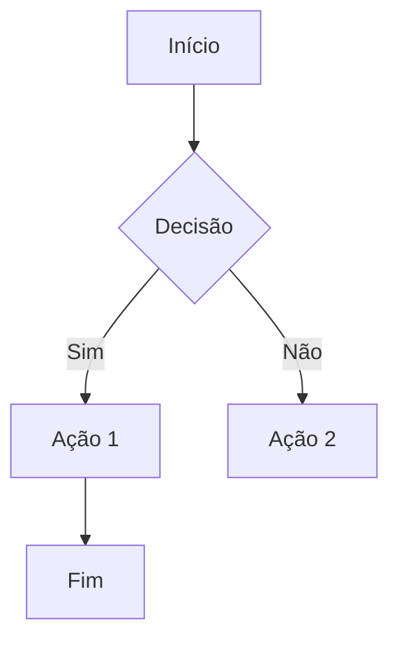

# TD Graph Editor

Editor visual e de código para diagramas de fluxo e grafos, com renderização via [Mermaid](https://mermaid.js.org/) e um canvas interativo completo.


## ✨ Funcionalidades

### Editor
- **Modo Código** — editor com syntax highlighting para sintaxe Mermaid (`graph TD`)
- **Modo Visual** — canvas interativo com drag-and-drop de nodes e conexões
- **Alternância fluida** — troca entre código e visual preservando posições e estrutura

### Visual Builder
- 🎯 **Nodes arrastáveis** com 10 tipos de formas (processo, decisão, início/fim, banco, etc.)
- 🔗 **Conexões com handles** — arraste das bolinhas nas bordas para conectar nodes
- 📐 **Âncoras precisas** — edges conectam na borda real de cada forma (círculo, losango, hexágono...)
- 🎨 **Box selection** — selecione múltiplos nodes arrastando uma área
- 🔙 **Undo/Redo** com batching inteligente durante drag
- 🧲 **Layout automático** — organização hierárquica top-down na primeira carga

### Preview
- Renderização Mermaid em tempo real
- **Zoom** (0.2× – 4×) com Ctrl+scroll
- **Pan** arrastando o canvas
- Temas **dark** e **light** sincronizados com a UI

### Exportação
- **SVG** — vetor limpo do diagrama
- **PNG** — renderizado em 2× para alta resolução

## 🚀 Começando

```bash
# Instalar dependências
npm install

# Servidor de desenvolvimento
npm run dev

# Build de produção (export estático)
npm run build
```

O build gera os arquivos estáticos na pasta `dist/`.

## 🏗️ Arquitetura

```
td-editor/
├── app/                  # Next.js App Router
│   ├── favicon.svg       # Favicon com tema adaptativo (dark/light)
│   ├── globals.css       # Variáveis CSS de tema
│   ├── layout.tsx        # Root layout
│   └── page.tsx          # Página principal (editor + preview)
├── components/
│   ├── Editor.tsx        # Editor de código Mermaid
│   ├── Toolbar.tsx       # Header com controles
│   ├── Preview.tsx       # Preview renderizado
│   ├── VisualBuilder.tsx # Canvas interativo
│   └── NodePalette.tsx   # Paleta de tipos de node
├── lib/
│   ├── graph.ts          # Tipos, parser Mermaid ↔ grafo, layout
│   ├── useGraphHistory.ts # Hook de undo/redo com batching
│   └── useMermaid.ts     # Hook de renderização Mermaid
└── public/
    └── logo.svg          # Logo do projeto
```

## 🎨 Tipos de Nodes

| Forma | Tipo | Label padrão |
|-------|------|--------------|
| ▭ Retângulo | `rect` | Processo |
| ▢ Arredondado | `rounded` | Início/Fim |
| ◊ Losango | `diamond` | Decisão |
| ○ Círculo | `circle` | Conector |
| ▭ Stadium | `stadium` | Terminal |
| ▭ Sub-rotina | `subroutine` | Sub-rotina |
| 🛢 Cilindro | `cylinder` | Banco |
| ⬡ Hexágono | `hexagon` | Preparação |
| ▱ Paralelogramo | `parallelogram` | Entrada/Saída |
| ⏢ Trapézio | `trapezoid` | Manual |

## 🧠 Parser Mermaid

O parser próprio converte código Mermaid para um grafo estruturado e vice-versa:



Suporta definições inline (`A[Texto] --> B{Texto}`) e labels em edges (`-->|Sim|`).

## 🛠️ Tecnologias

- [Next.js](https://nextjs.org/) 16 — Framework React
- [React](https://react.dev/) 19 — UI library
- [TypeScript](https://www.typescriptlang.org/) — Tipagem estática
- [Tailwind CSS](https://tailwindcss.com/) — Estilização utilitária
- [Mermaid](https://mermaid.js.org/) 10 — Renderização de diagramas

## 📄 Licença

MIT
